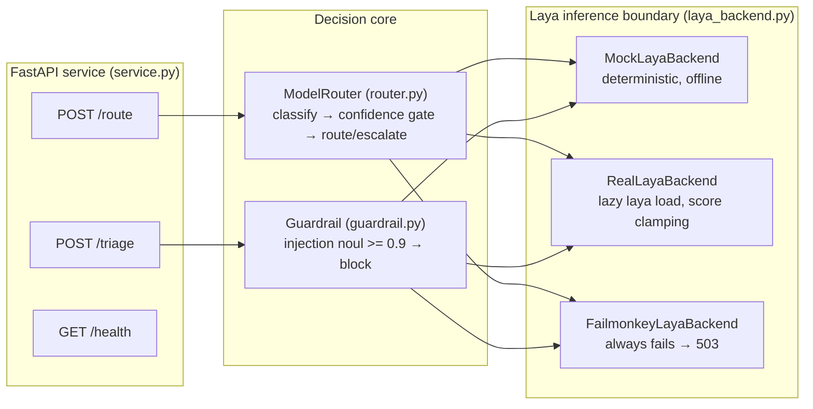
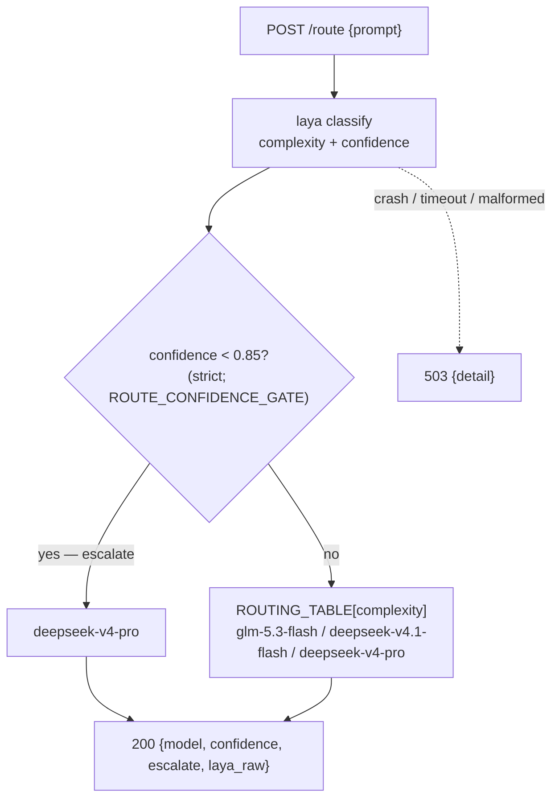
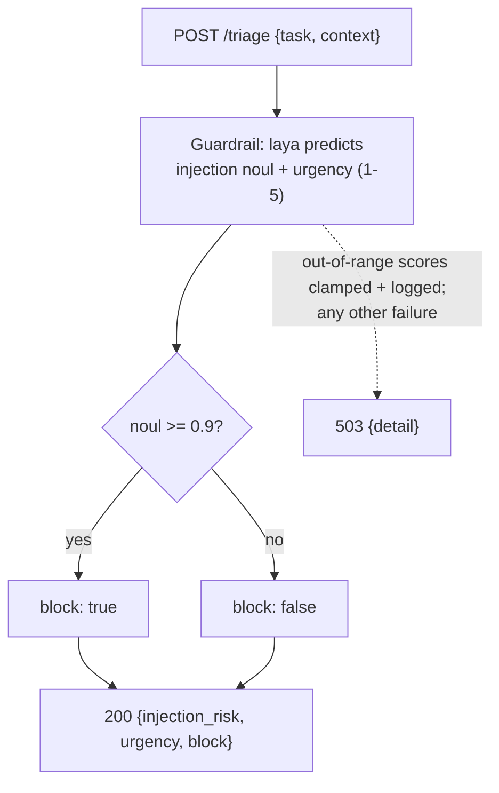

# laya-router

A small FastAPI model router that turns a prompt into a typed complexity decision. It keeps the laya inference boundary isolated, uses a deterministic mock by default, and can be switched to pretrained laya models when available.

## Architecture



The service validates every response against its schema inside the guarded boundary, so backend failures — including schema-violating model answers — surface as `503 {"detail": ...}` rather than 500s.

## Quickstart

```bash
uv sync --extra dev
uv run uvicorn laya_router.service:app --reload
curl -X POST localhost:8000/route -H 'content-type: application/json' -d '{"prompt":"Design a secure production architecture"}'
curl -X POST localhost:8000/triage -H 'content-type: application/json' -d '{"task":"Please do this urgently","context":"release outage"}'
curl localhost:8000/health
```

If uv is unavailable, create a virtualenv and install `.[dev]` with pip. The CLI is also available as `uv run python -m laya_router route "What is 2+2?"`.

## Decisions and backend switch

The routing table is trivial → `glm-5.3-flash`, medium → `deepseek-v4.1-flash`, hard → `deepseek-v4-pro`. Classifications below 0.85 confidence escalate to the pro model (strictly below; at the gate the regular table model is used). Triage blocks injection risk at ≥ 0.9 and reports urgency on a 1–5 scale. If the laya inference boundary raises at request time (backend crash, timeout, malformed payload), both endpoints return `503` with a JSON `{"detail": ...}` body.





The default `MockLayaBackend` is deterministic and needs no model download. To use the verified real backend, install the optional dependency and set `LAYA_BACKEND=real`:

```bash
uv sync --extra real
LAYA_BACKEND=real uv run uvicorn laya_router.service:app
```

`RealLayaBackend` lazily calls `laya.load("convaiinnovations/laya", subfolder="typed-decisions")` on its first prediction and then uses laya's `predict(state, questions)` interface. With `laya==0.3.4`, model loading takes roughly 20–30 seconds in this environment (about 22 s in a September 2026 run) and is logged; once loaded, CPU predictions return in tens to low hundreds of milliseconds and `/health` stays fast. Score-type answers that fall outside the question's criteria (observed: urgency 0 against a 1–5 scale) are clamped into range at the backend boundary and the adjustment is logged. The `typed-decisions` checkpoint is the workflow-decision model (the `laya` and `multilingual` subfolders are also available). Real laya confidence values can be low (for example, 0.126), so the default 0.85 escalation gate will commonly route to `deepseek-v4-pro`; do not replace laya's own confidence with a fabricated value. Set `ROUTE_CONFIDENCE_GATE` to change the gate, for example `ROUTE_CONFIDENCE_GATE=0.7`.

`LAYA_BACKEND=failmonkey` selects an always-failing backend (it raises inside `predict` on every call) so the documented 503 convention can be exercised over real HTTP.

## Testing

```bash
uv run pytest -q
```

All tests run offline against the deterministic mock backend — no model is downloaded or loaded. The current suite is 93 tests across three files:

- `tests/test_router.py` (36 tests): every routing-table entry (trivial → `glm-5.3-flash`, medium → `deepseek-v4.1-flash`, hard → `deepseek-v4-pro`) reached through both real prompts and canned backends; confidence-gate semantics parametrized around the 0.85 boundary and the `ROUTE_CONFIDENCE_GATE` env override with explicit expected outcomes (strict `<`: confidence exactly at the gate does not escalate); unknown and case-variant complexity labels rejected by the `Classification` schema; empty and very long prompts; the real-backend path with a fake laya `Agent` verifying lazy single load, raw-field passthrough, escalation, and clamping of out-of-range scores into the question criteria; and a <100 ms bound on the mock `/route` path.
- `tests/test_guardrail.py` (54 tests): the triage guardrail — injection (`noul`) block threshold at 0.9 parametrized over boundary values 0.0–1.0 (inclusive at 0.9); urgency 1–5 mapping and schema range checks; a canonical keyword injection corpus (blocked) plus benign corpus (allowed) and encoded/roleplay variants the mock explicitly does not flag (documented limitation); malformed `/route` and `/triage` requests returning 422 with JSON `detail`; end-to-end FastAPI request/response contracts; and `503 Service Unavailable` with `{"detail": ...}` when the laya inference boundary raises (crash, timeout, malformed payload) — including schema-violating backend answers (regression tests for the audited urgency-0 and out-of-range-confidence cases) and the `LAYA_BACKEND=failmonkey` backend on both endpoints.
- `tests/test_compare_jev.py` (3 tests): Jev comparison parsing, agreement, and table rendering.

## Benchmark

```bash
uv run python scripts/benchmark.py -n 8
```

The benchmark prints decisions and rough relative cost/latency savings against always selecting `deepseek-v4-pro`. Its units are illustrative rather than provider billing or measured wall-clock latency.

## Jev comparison

Jev (`opencode/jev-1.13-free`) is a competing decision-model API available through the OpenCode CLI. Compare it with the deterministic, offline laya backend using:

```bash
uv run python scripts/compare_jev.py
```

The script sends ten fixed prompts to both classifiers and prints each decision, ground truth, model agreement, and mean wall-clock latency. It uses this non-interactive OpenCode command internally:

```bash
opencode run --model opencode/jev-1.13-free --format json '...routing prompt...'
```

> **Historical note (observed 2026-09-20):** the Jev provider returned HTTP 500 (`provider.internal`) for all prompts, including a trivial `Reply OK` test — a server-side outage, not an invocation problem. The script detects this and prints laya-only results with a non-zero exit, so it can be re-run as soon as Jev recovers.
>
> When Jev answers, the verdict line reflects laya's published benchmarks against Jev: laya wins typed decisions (0.766 vs 0.727) and calibration (ECE 0.081 vs 0.246) at ~7× lower latency; Jev is stronger on label spaces with more than 20 options. Straightforward tasks dominate the benchmark set above, and laya-with-mock missed only 1/10 (a linguistically-trivial but multi-step case it judged medium).

Example output (latencies vary):

```text
prompt | laya | jev | ground truth
--- | --- | --- | ---
What is 2 + 2? | trivial | trivial | trivial
Design a secure production architecture for a payments API | hard | hard | hard

Laya/Jev agreement: 80%
Mean latency: laya 0.1ms; Jev 245.0ms
```

If OpenCode or Jev is unavailable, laya results are still printed and the command exits non-zero. The published laya benchmark reports stronger typed decisions (0.766 vs Jev's 0.727) and calibration (ECE 0.081 vs 0.246), while Jev performs better on label spaces with more than 20 options.
